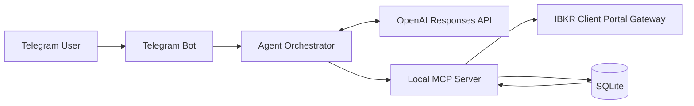

# Ole Trading Assistant

A local-first, LLM-powered trading copilot for Telegram. It combines OpenAI tool calling, an in-process MCP server, Interactive Brokers market data, persistent stock memory, and a human-approved paper-trading workflow.

> This project is for research and personal experimentation. It is not financial advice. Order execution is restricted to verified IBKR paper accounts.

## Highlights

- **Multilingual orchestration:** Detects the user's language, replies in kind, and routes requests to local MCP tools for watchlists, quotes, price history, technical indicators, portfolio data, paper-order status, and stock memory.
- **Market-data pipeline:** Stores layered IBKR OHLCV history in SQLite and refreshes watched symbols in the background.
- **Technical analysis:** Calculates SMA, EMA, RSI, ATR, volume ratio, period returns, range statistics, and maximum drawdown locally.
- **Persistent retrieval:** Uses language-independent semantic labels to index conversations by stock and retrieve relevant analysis, risks, decisions, and outcomes in later chats.
- **Paper-trading safety:** Requires What-If preview, explicit confirmation tokens, account verification, notional limits, and broker-warning confirmation.
- **Privacy controls:** Keeps credentials in `.env`, restricts Telegram users through an allowlist, redacts broker responses from local memory, and suppresses secret-bearing HTTP logs.

## Architecture



The MCP server runs in-process: no public endpoint, tunnel, listening port, or separate daemon is required. The model receives tool schemas but cannot choose a different Telegram user identity. No order-placement or cancellation tool is exposed to natural-language chat.

## Quick Start

### Prerequisites

- Python 3.12 recommended
- An OpenAI API key
- A Telegram bot token
- IBKR Client Portal Gateway and an IBKR account

### Install

```bash
git clone https://github.com/OliverrrD/ole_trading_assistant.git
cd ole_trading_assistant
python -m venv .venv
source .venv/bin/activate
pip install -r requirements.txt
cp .env.example .env
```

Configure `.env` with at least:

```env
TELEGRAM_BOT_TOKEN=...
TELEGRAM_ALLOWED_USER_IDS=...
OPENAI_API_KEY=...
OPENAI_MODEL=...
IBKR_BASE_URL=https://localhost:5000/v1/api
```

Never commit `.env`. If a Telegram token appears in logs or chat, revoke it immediately through BotFather.

### Start IBKR

Run Client Portal Gateway, open `https://localhost:5000`, and authenticate. Keep the Gateway running while using the assistant.

### Validate and Run

```bash
python scripts/check_connectivity.py
python main.py
```

## Usage

Plain-language examples:

- `Add AAPL to my watchlist.`
- `Show me AAPL's daily prices for the past year.`
- `Analyze NVDA's daily technical state.`
- `What positions do I currently hold?`
- `What risks have I previously discussed for MSFT?`

Useful deterministic commands:

```text
/watch AAPL
/quote AAPL
/technical AAPL 1d
/price_history AAPL 1y
/portfolio
/history AAPL
```

## Paper Trading

Trading is disabled by default. To enable it, log in to the IBKR Gateway with a paper account and configure its explicit `DU...` account ID:

```env
IBKR_ACCOUNT_ID=DU1234567
IBKR_TRADING_MODE=paper
IBKR_MAX_ORDER_NOTIONAL_USD=1000
IBKR_MAX_DAILY_NOTIONAL_USD=5000
```

Order flow:

```text
/order buy AAPL 1 lmt 150
/confirm <token>
/orders
```

The service verifies the paper session and account before submission. Natural-language messages can discuss or draft trades but cannot execute them.

## Data and Privacy

- Watchlists, OHLCV bars, technical snapshots, conversation memory, and tool-call audits are stored in `data/market.db`.
- The database and `.env` are ignored by Git but are not encrypted at rest.
- Market data may be real-time, delayed, frozen, or unavailable depending on IBKR permissions.
- Stock-memory retrieval is symbol-indexed and recency-based; it is intentionally not a vector database.
- Portfolio data is sent to the configured model endpoint only when enabled and requested.

## Project Structure

```text
app/agent_orchestrator.py   LLM-to-tool orchestration
app/local_mcp.py            Local MCP tools and user scoping
app/ibkr_client.py          IBKR Gateway integration
app/market_data_service.py  History, quotes, and indicators
app/market_store.py         SQLite persistence and retrieval
app/trading_service.py      Paper-order approval workflow
app/telegram_bot.py         Telegram interface
```
